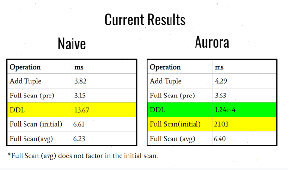
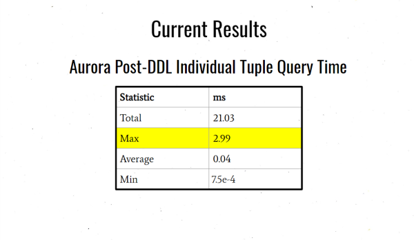
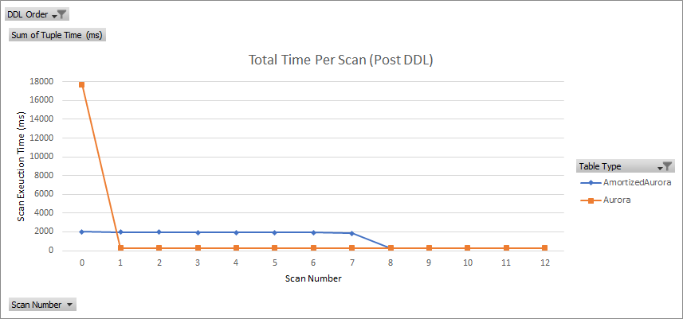
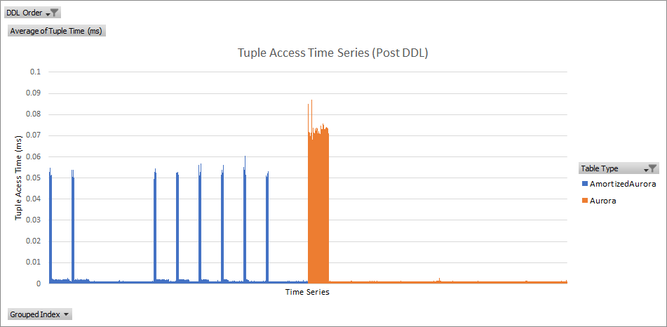
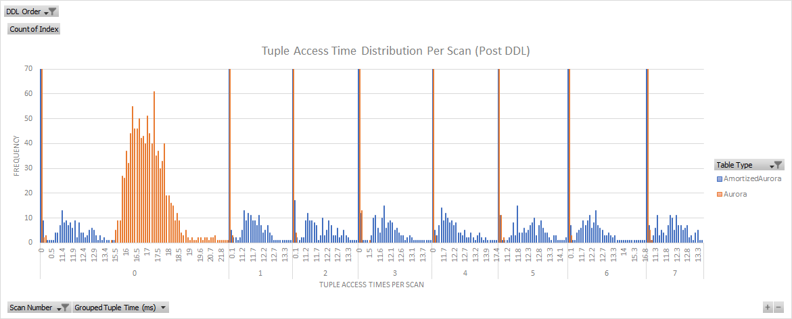

## Benchmark Operations

We ran the following operations (in order) on each table, measuring latency as described above:

1. Create a table of 1024 integer attributes
2. Add 8 * 64 tuples to fill the table
3. Full scan to ensure all 8 * 64 tuples are persisted in memory
4. DDL: Increase the table size to store an extra 1024 integer columns
5. Full scan (multiple times) to measure latency after DDL

## Benchmark Results

### Amazon Aurora

This figure compares the Naive vs Aurora operation times:

This figure shows the large variance in individual tuple access times in the full scan directly after a Fast DDL in the Aurora table:

### Amortized Aurora

This figure shows that the Amortized Aurora table successfully spreads out the cost of the initial full scan across multiple scans:

This figure shows a how tuple access times are spread out over time:

This figure shows the tuple access time frequency distribution per scan:

## Analysis

### Amazon Aurora

Aurora's fast DDL implementation does increase the DDL transaction time, but results in:

- a 3x increase in total time in the next full scan
- up to a 75x delay in individual tuple access times within that full scan (directly after the DDL)

This is better known as a **long tail latency** problem.
If not handled correctly, this could lead to **tail latency amplification** in upstream services.

### Amortized Aurora

The Amortized Aurora implementation successfully amortizes the very high time in the first scan right after DDL.
Additionally, it reduces individual tuple access times greatly.

This reduces the **long tail latency** problem.

For further explanation and analysis, please view the supporting documents in the main [README.md](../README.md).